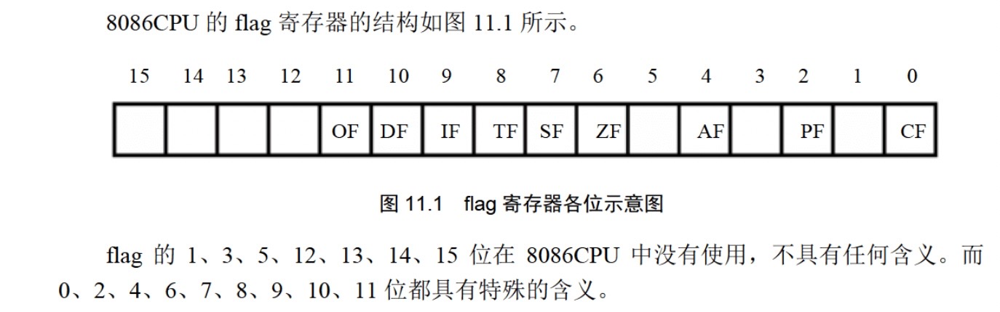

# 寄存器

## 通用寄存器

- 32位:EAX EBX ECX EDX ESI EDI
- 64位:RAX RBX RCX RDX RSI RDI R8-R15
- 16位: AX BX CX DX SI DI (还可继续细分位高八位和第八位,例如AX还可分为AH和AL)


## 段寄存器和指针变址寄存器

(前面加上R就是64位,加上E就是32位,这里先省略了)

- **代码段寄存器CS, 指令指针寄存器IP**

  CPU默认将`CS:IP`指向的内容作为指令来执行,加载一个程序时,`CS:IP`自动指向程序的入口处

  在读取完一条指令后,IP的值会自动增加,准备读取下一条指令

  `mov`指令不能直接用于修改`cs:ip`的值. 因而`mov cs 0001H`这种指令是不被允许的

  可以通过`jmp`指令来实现对`cs:ip`的修改,例如:

  ```assembly
  jmp x:y   # 将cs的值修改为x,ip的值修改为y,接下来将读取x:y处存放的指令
  jmp ax    # 将ax中的值给ip,cs不变
  ```

  

- **数据段寄存器DS和指示数据地址的`[address]`**

  **这里`[address]`相当于去`address`这个地址的位置去取数据,相当于c语言中的`*`** 当设置好了`DS`的值后,直接通过`[x]`就可以取到`ds:[x]`这个位置的值,例如:

  ```
  mov bx,1000H
  mov ds,bx
  mov al,[0] 这里就相当于将 从ds:[0]处取一个字节(8位)存入al
  ```

- **栈段寄存器SS和栈顶指针寄存器SP,以及栈底指针寄存器BP**

  `ss:sp`指向栈顶(`PUSH`入栈时,`sp`值减小,栈顶上移;`POP`出栈时,`sp`值增大,栈顶下移)(**栈是从高地址向低地址增长**)

  `ss:bp`指向**当前函数栈帧**的底部

- 此外段寄存器还有ES,FS,GS等,用到了再补充


# 标志位寄存器



- ZF：执行结果是否为0（1为是，0为否）

- PF：执行的二进制结果中1的个数是否为偶数(奇偶校验标识)

- SF：进行有符号运算时，执行结果是否为负（补码机制）

- CF：进行无符号运算时，是否需要进位（结果超出寄存器范围）或者借位（结果小于0）
- AF : 辅助进位标识, 运算结果第三位进位时置1
- OF: 溢出标识, 进行有符号运算时，有无溢出（溢出会导致运算结果不正确）


# 指令


- 有条件跳转:(根据特定标志位的值来决定是否跳转)

| 指令和说明                                     | `cmp a,b`的结果 | 标志位条件 |
| ---------------------------------------------- | --------------- | ---------- |
| jz/je 为零则跳转                               | a=b             | ZF=1       |
| jnz/jne 不为零则跳转                           | a!=b            | ZF=0       |
| jc 进位则跳转                                  |                 | CF=1       |
| jnc 不进位则跳转                               |                 | CF=0       |
| jo 溢出则跳转                                  |                 | OF=1       |
| jon 无溢出则跳转                               |                 | OF=0       |
| js有符号跳转                                   |                 | SF=1       |
| jns无符号跳转                                  |                 | SF=0       |
| jp偶校验跳转                                   |                 | PF=1       |
| jnp奇校验跳转                                  |                 | PF=0       |
| jb jl小于则跳转 jnae jna jng jnge不大于则跳转  | a<b a<=b        |            |
| ja jg大于则跳转 jnbe  jnb jnl jnle不小于则跳转 | a>b a>=b        |            |


